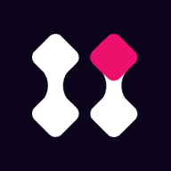
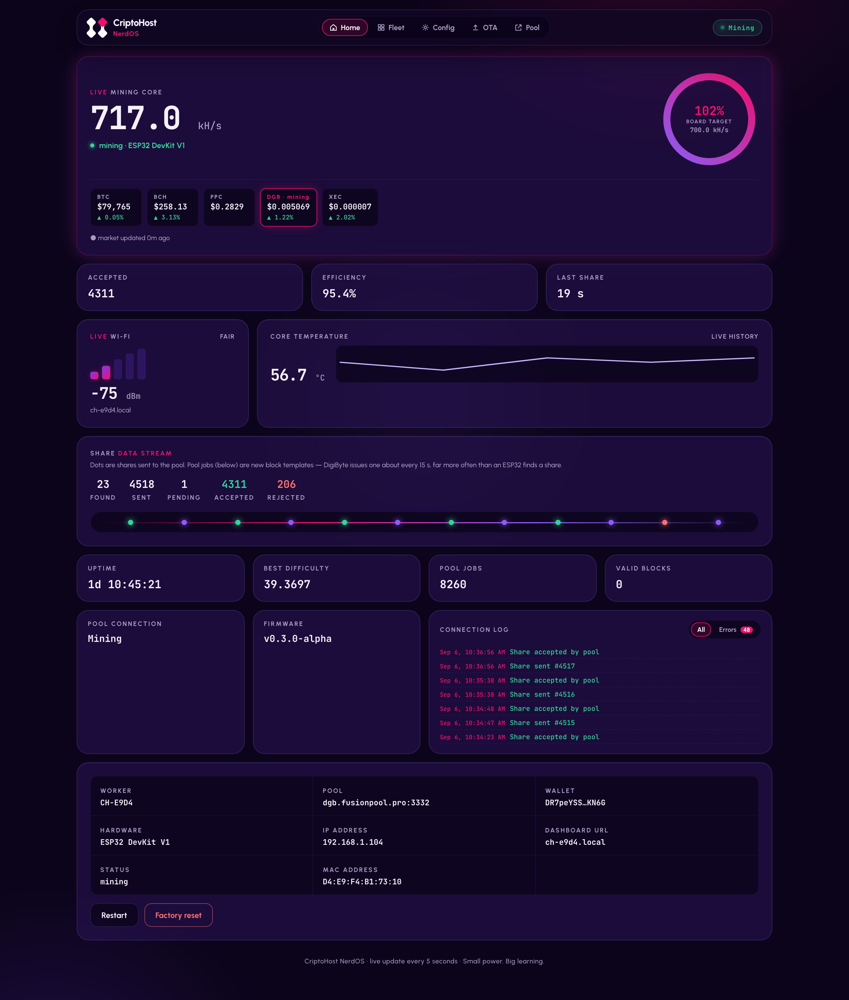
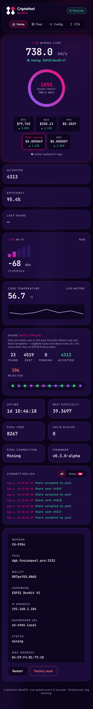
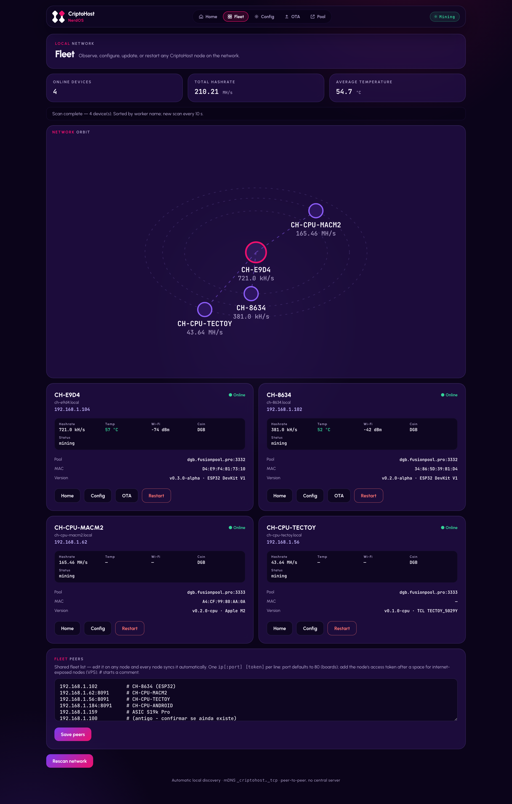
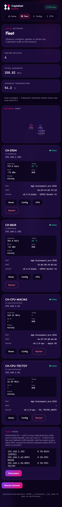
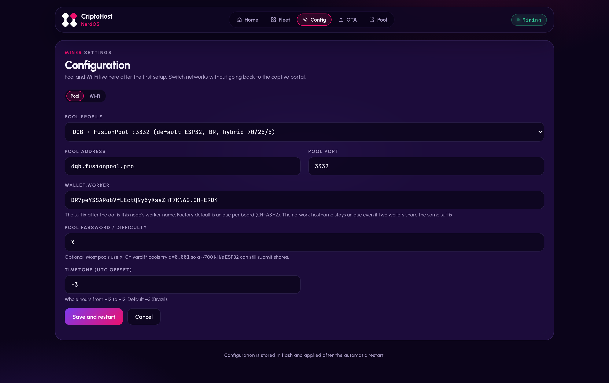
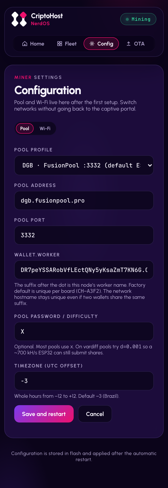
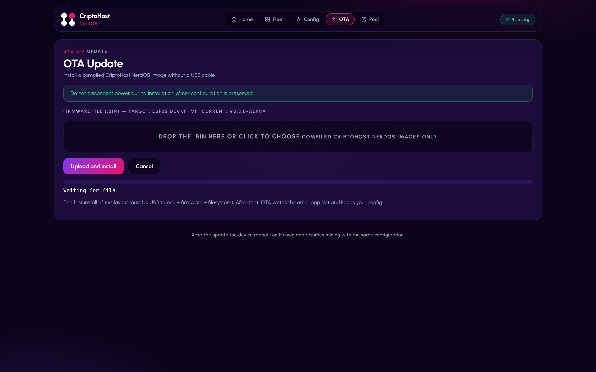
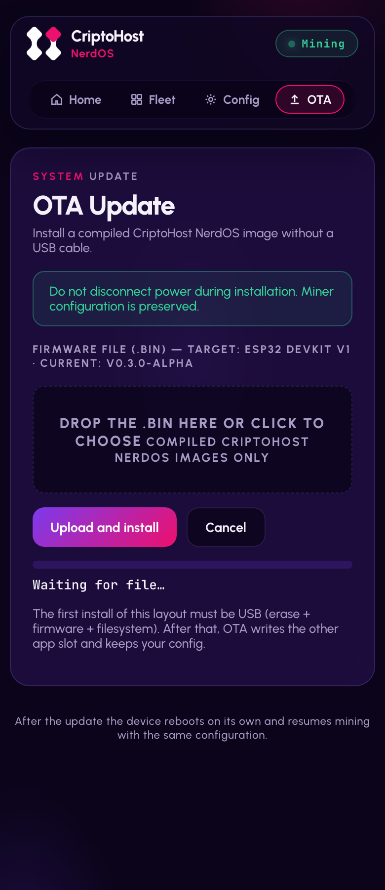

<div align="center">



# CriptoHost NerdOS

**Turn a $6 ESP32 into a real SHA-256 miner — with a web dashboard, fleet view and OTA updates.**

[🇧🇷 Português](README.md) · 🇺🇸 English

[](https://github.com/criptohost/criptohost_nerdos/actions)
[](https://github.com/criptohost/criptohost_nerdos/releases)
[](LICENSE)

*A [Cripto Host](https://cripto.host) product — "Mining made easy"*

</div>

---

## 🧭 What is this?

CriptoHost NerdOS is an **open-source mining firmware** for ESP32 boards. It connects to a real pool, mines real SHA-256d, and shows everything on a **local web dashboard** — no app, no cloud, no sign-up.

> ⚠️ **Honest framing**: this is a **hobby and education** project. An ESP32 DevKit V1 does ~700 kH/s; an ASIC does 200 TH/s — 300 million times more. You won't get rich: you'll **learn** how Stratum, difficulty, shares and blocks work, watching it all live. Expected return is ~zero, and we say that proudly.

## ✨ What it does

- ⛏️ **Real mining** — SHA-256d on the ESP32 hardware accelerator with a register-level asm pipeline (~705 kH/s sustained on DevKit V1, [bench](docs/BENCH-SHA.md)), full Stratum V1
- 📊 **Live dashboard** — hashrate ring, shares, efficiency, best difficulty, temperature, Wi-Fi, market prices, connection log
- 🕸️ **Peer-to-peer fleet** — every node discovers its neighbors via mDNS; any board shows the whole fleet, no central server
- 🔁 **Replicated peers list** — for nodes beyond mDNS reach (VPS, Android): edit the list on the Fleet page of **any** node — boards included — and every other node syncs it within ~1 min (newest revision wins)
- 🔄 **Browser OTA** — update firmware without a USB cable, dual A/B slots, config preserved
- 📱 **Installs as an app** — PWA: "Add to Home Screen" on iPhone/Android
- 🛰️ **Network orbit** — a live fleet map on the Fleet page: your nodes connected in rings around the current one
- 🔭 **Sees third-party miners** — Bitaxe, NerdQAxe/NerdOctaxe (AxeOS family) and Antminer ASICs (stock firmware or Braiins OS, via the CGMiner API) on the same network show up as amber cards with hashrate, temperature, pool and version (discovery done by CPU/CH Agent nodes)
- 🌐 **Easy onboarding** — first boot opens the `CriptoHostAP` Wi-Fi portal
- 🪙 **Multi-coin SHA-256d** — DigiByte (default, frequent shares), BTC, BCH, XEC, PPC, BC2, BCH2 (FusionPool with per-device ports, or BCMonster) — plus free Namecoin + Fractal Bitcoin via merged mining on BCMonster

## 🖼️ Screens

Real captures from a mining ESP32 DevKit V1 (validation fleet: boards + Mac + server + Android on the same Fleet).

| | Desktop | Mobile |
|---|---|---|
| **Home** |  |  |
| **Fleet** |  |  |
| **Config** |  |  |
| **OTA** |  |  |

## 🚀 Up and running in 10 minutes

**You'll need:** an ESP32 board (DevKit V1 ~$6, ESP32-S3 or LilyGO T-Display S3), a USB cable and a wallet for the coin you want to mine (DigiByte recommended).

1. **Download the firmware** for your board from the [Releases page](https://github.com/criptohost/criptohost_nerdos/releases) — grab the `*-full.bin` file (bootloader, app and dashboard included).
2. **Flash it** at offset `0x0` (esptool, ESP Flash Tool or the web flasher):
   ```bash
   pip install esptool
   esptool.py write_flash 0x0 criptohost-nerdos-vX.Y.Z-ch-devkit-v1-full.bin
   ```
3. **Join the board's Wi-Fi** — network `CriptoHostAP` (password `MineYourCoins`) — and follow the portal: pick your network, enter `wallet.worker`.
4. **Open the dashboard** — `http://ch-XXXX.local` (name shown in the portal) or the board's IP. Within ~30 seconds the first accepted shares show up in the log. 🎉
5. **(Optional)** On your phone: Safari/Chrome → Share → **Add to Home Screen** — it becomes an app.

> 💡 Future updates: through the dashboard's **OTA** page with the `*-ota.bin` file — no cable.

## 🕸️ The fleet (and its siblings)

Every CriptoHost node speaks the same contract: it announces `_criptohost._tcp` over mDNS and answers `GET /api/status`. The result: **boards, PCs, servers and phones show up on the same Fleet page**, each with its own card, aggregates and remote actions (Home, Config, Restart).

| Repository | What it mines | Typical hashrate | Recommended DGB pool |
|---|---|---|---|
| **criptohost_nerdos** (this one) | ESP32 (DevKit V1, S3, T-Display) | ~705 kH/s (DevKit V1) · ~300 kH/s (S3) | `dgb.fusionpool.pro:3332` (default) |
| [criptohost_cpuminer](https://github.com/criptohost/criptohost_cpuminer) | Windows, Linux and macOS (CPU) | 20–165 MH/s | `dgb.fusionpool.pro:3333` |
| [criptohost_mobile](https://github.com/criptohost/criptohost_mobile) | Android via Termux (iOS = panel) | ~47 MH/s | `dgb.fusionpool.pro:3333` |

## 🔌 API

Every node exposes a local HTTP API (the same one the dashboard uses):

```bash
curl http://ch-XXXX.local/api/status
```

```json
{
  "worker": "CH-8634", "hardware": "ESP32 DevKit V1", "status": "mining",
  "hashrate_khs": 381.0, "temp_c": 47.0, "rssi_dbm": -35,
  "shares": {"found": 251, "sent": 251, "accepted": 241, "rejected": 10, "pending": 0},
  "best_difficulty": 7.16, "valid_blocks": 0
}
```

Routes: `/api/status` · `/api/config` · `/api/fleet` · `/api/peers` · `/api/events` · `/api/identify` · `/api/restart` · `/api/ota`. Full reference in [docs/API.md](docs/API.md). **This contract is frozen** — it's what lets different generations and platforms live on the same fleet.

## ⛏️ Pools and coins

The default is **DigiByte on FusionPool** (`dgb.fusionpool.pro:3332`, password `X`; Brazil, no sign-up): low difficulty = frequently accepted shares = constant feedback for learning. For the CPU/Android siblings the recommendation is port `3333` (micro-miner tier) on the same pool. Ready-made profiles in Config for BTC (lottery), BCH, XEC and PPC — details in [docs/POOLS.md](docs/POOLS.md). Want full independence? Run your own node+pool: [docs/SOLO-NODE.md](docs/SOLO-NODE.md).

## ❓ Honest questions

**Will I make money?** No. On DGB you accumulate fractions of a cent; on BTC the block odds are ~1 in millions of years. The product is the learning (and the accepted-shares counter on your dashboard).

**Power usage?** ~1–2 W per board — less than an LED bulb. Leave it on guilt-free.

**Does it get hot?** 45–60 °C while mining, normal for the chip. The dashboard shows live temperature.

**Do I need an account anywhere?** Just a wallet for the coin (the default pool needs no sign-up). No cloud, no telemetry of ours.

## 🧑‍💻 For developers

```bash
git clone https://github.com/criptohost/criptohost_nerdos && cd criptohost_nerdos
pip install platformio
pio run -e ch-devkit-v1              # build (targets: ch-devkit-v1, ch-esp32s3, ch-tdisplay-s3)
pio run -e ch-devkit-v1 -t upload    # flash app via USB
pio run -e ch-devkit-v1 -t uploadfs  # flash dashboard (LittleFS)
python3 tools/mock/mock_server.py    # dashboard in your browser, no board needed (http://localhost:8091)
```

Architecture, code map and decisions: [docs/ARQUITETURA.md](docs/ARQUITETURA.md) (PT-BR with EN summaries) · Roadmap: [docs/PLANEJAMENTO-ESCOPO.md](docs/PLANEJAMENTO-ESCOPO.md) · Contributing: [CONTRIBUTING.md](CONTRIBUTING.md).

## 📜 License, trademark and credits

- **Code**: [GPL-3.0](LICENSE), inherited from the upstream [NerdMiner_v2](https://github.com/BitMaker-hub/NerdMiner_v2) (BitMaker and community) — full credit for the mining core goes to them.
- **Trademark**: free code, protected brand — the Cripto Host name, logo and identity follow [BRANDING.md](BRANDING.md). Fork freely; remove the brand (`-D CH_UNBRANDED` helps).
- Category inspirations: HAN, SparkMiner, BitMiner24.

## 💬 Contact

Questions, ideas or partnerships: **fale@cripto.host** · Issues and PRs welcome.

---

<div align="center">

*Small power. Big learning.* 💜

</div>
